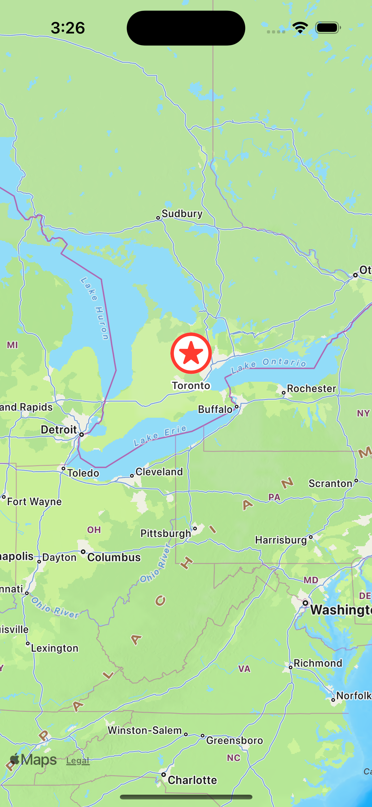
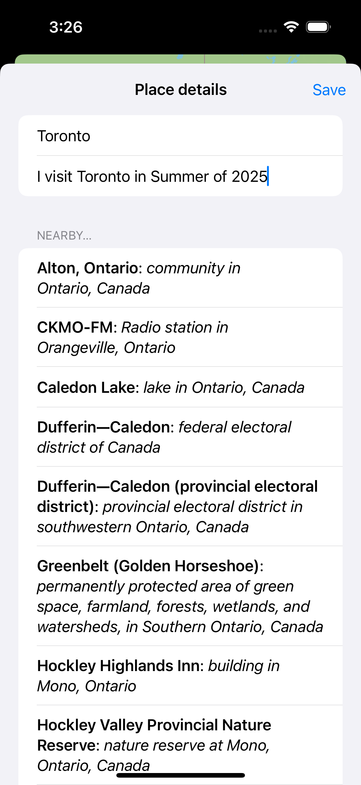

# BucketList

BucketList is a dynamic iOS app built using SwiftUI, designed to help users create and manage a list of places they want to visit. The app integrates with MapKit for location services and Wikipedia for fetching interesting facts about each location. It uses the devices built in biometrics (Face ID or Touch ID) to authenticate the user.

    
    
    

## Features

- **Location Management**: Users can add, edit, and manage locations they wish to visit directly on an interactive map.
- **Authentication**: Features a security mechanism to unlock and access personal location lists.
- **Dynamic Information**: Fetches and displays relevant information about nearby points of interest from Wikipedia.
- **Personalization**: Allows users to personalize details and descriptions for each place on their bucket list.

## How to Use

1. Open the app and authenticate to unlock your places.
2. Tap on the map to add a new location or select an existing location to edit.
3. Long press to open form to add or update the name and description of the location.
4. Explore nearby points of interest loaded dynamically from Wikipedia.
5. Save your changes and manage your bucket list with ease.

## Technologies Used

- **SwiftUI**: Utilized for crafting the app's interface, ensuring a smooth and engaging user experience.
- **MapKit**: Integrated for handling geographic locations, allowing users to pinpoint and review places on a map.
- **Wikipedia API**: Used for enriching location details with informative content from Wikipedia entries.
- **Swift**: The programming language employed for developing the app's logic and functionalities.
- **Xcode**: The development environment used for crafting iOS applications, playing a pivotal role in the app’s development and testing.

## Getting Started

To run this project locally, follow these steps:

- Ensure Xcode is installed on your Mac.
- Clone this repository to your local machine.
- Open the project in Xcode.
- Build and run the project on an iOS simulator or a real device.

If you are using Xcode's simulator:

- enroll in Face ID from the features tab
- use matching and non-matching face from features tab to test authentication

## Credits

This project is part of the ["100 Days of SwiftUI"](https://www.hackingwithswift.com/100/swiftui) course by Paul Hudson. I learned how to build this project and further develop my SwiftUI skills through the course.

## Learning Experience

In addition to following the main project instructions, I completed extra challenges provided at the end of the course where there were no instructions.
